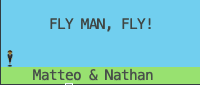

# FlyManFly 1.0
Amazing Shell game
<p align="center">
  
</p>

## Installation

1) Clone the repo using:
```
git clone https://github.com/MatteoArna/FlyManFly.git
```
1) Open the shell in the game folder
2) Use the command below to give the script the permission to run the Game.
```
sudo chmod 777 ./go.sh
```
4) Enjoy FLyMan, Fly!

